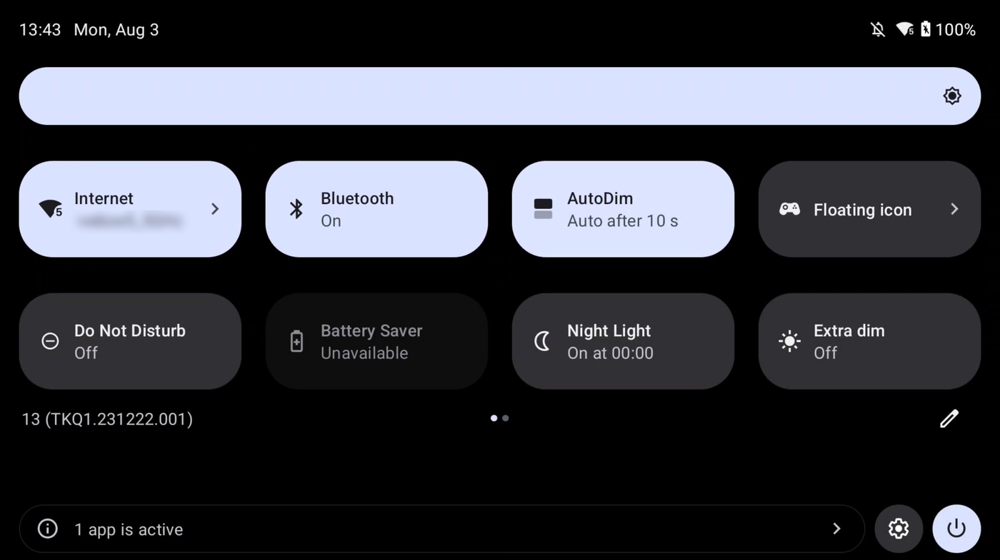
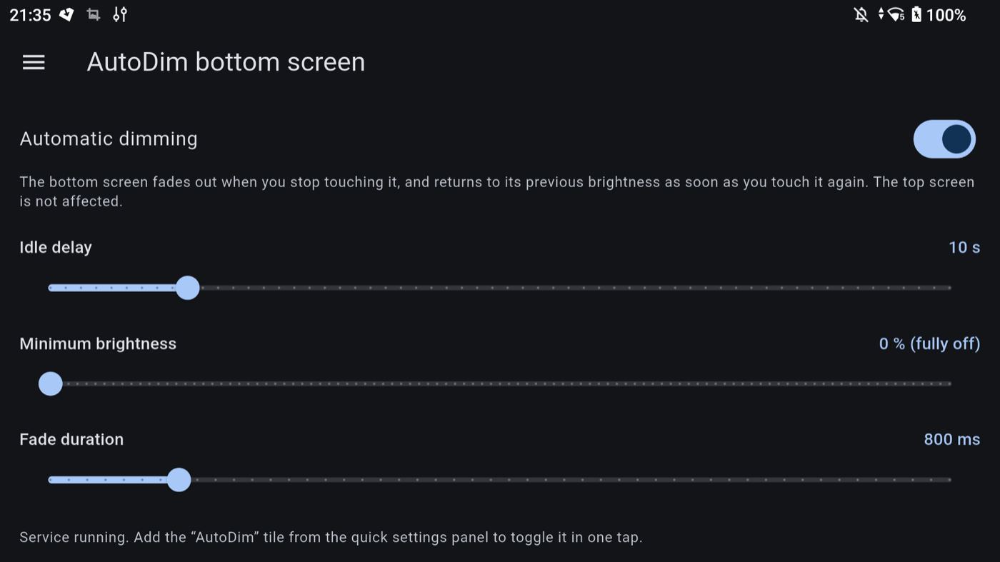
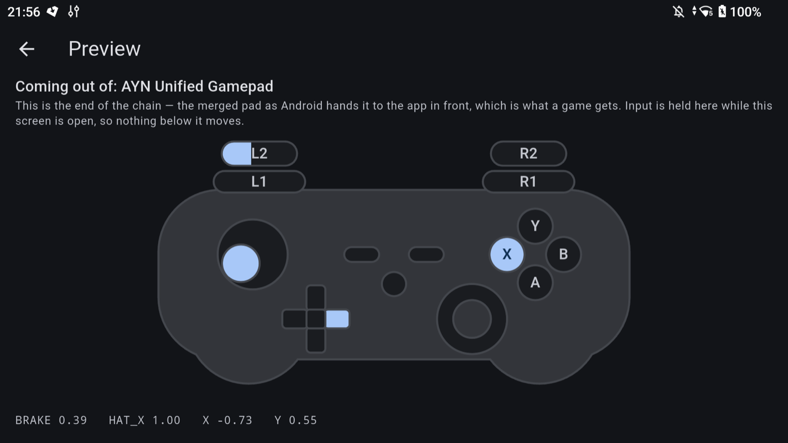

#  AYN Thor Root Toolbox

**Experimental · Root required · Vibe coded · No support · Build it yourself**

> ### Do not install this.
>
> This entire project was vibe coded with Claude Code (Opus 5). It is an
> experimental proof of concept, it needs a **rooted** device, and it was only
> ever tried on one (AYN Thor / kalama, Android 13, Magisk 30.7). Getting it
> wrong can leave the device with no usable controller, a screen too dark to
> read, or a boot that does not come back on its own.
>
> **There is no support.** No issues answered, no pull requests reviewed, and no
> promise that any of it still works on your device or your ROM.
>
> **Building it yourself is the recommended path.** This app asks for root, and
> a root app is exactly the kind of thing you should not take as a binary from a
> stranger. Read the code first, then:
>
> ```sh
> flutter build apk --release --target-platform android-arm64
> ```
>
> A signed APK is attached to the [GitHub release](../../releases) for people who
> won't build one. If you use it, [verify it](#verifying-a-release-apk) — the
> checksum and the signing fingerprint are published with it, and an APK that
> matches neither did not come from here.
>
> [Build](#build) has the full command line, [Install](#install) has what else
> has to go on the device. Everything you do with it is at your own risk, and
> yours alone.

Tweaks for the AYN Thor, a dual-screen Android handheld, in one app with a
navigation drawer. All of them are proofs of concept and none of them are
maintained. Read the code before you run it.

| drawer entry | what it does | superuser access |
|---|---|---|
| [AutoDim bottom screen](#autodim-bottom-screen) | fades the **bottom** screen out when you stop touching it | none in the app — a Magisk service does the work |
| [4:3 on external screen](#43-on-external-screen) | forces the **top** screen to 4:3 while an external screen is plugged in | the app calls `su`, but only while switched on |
| [Gamepad merger](#gamepad-merger) | merges every controller into one, so any pad you pick up is player 1 | the app calls `su` when its screen is opened, and continuously in the background if per-game profiles are switched on |
| [Shortcut](#shortcut) | button combinations that change brightness or volume, inside a game | the daemon runs them, as root |
| [NSO GameCube pad](#nso-gamecube-pad) | brings the Switch 2 pad up over BLE and hands it to the merger | only to publish the pad as an input device |

### One app, several root models

They reach root differently on purpose. AutoDim has to watch an input device and
write a sysfs node continuously, so a Magisk service does the work and the app is
only a settings screen writing a `key=value` file the daemon reads — the app
itself never calls `su`. The 4:3 tool only fires a couple of `wm` and `setprop`
commands on hotplug, so it calls `su` directly and needs no daemon. The gamepad
merger has a native daemon of its own and the app is a front end that shells out
to it.

Merging them into a single APK costs something, since Magisk grants superuser
access **per package**: an app that also hosts the root-free AutoDim screen can
now ask for root. That is contained rather than ignored:

- the watch service only starts when the 4:3 tool is switched on, and stops
  itself if it is switched off;
- opening the app on the AutoDim screen starts nothing;
- property *reads* go through plain `getprop`, so nothing asks for root while the
  DP props are already correct;
- the gamepad screen only talks to root once it is actually opened from the
  drawer, not when the app starts;
- per-game profiles run their own background service, and only while that
  feature is switched on — same shape as the 4:3 tool's watch service;
- the NSO screen needs root only to publish the pad as an input device, and not
  at all with that switched off.

Opening the AutoDim screen, or using its quick settings tile, therefore never
triggers a superuser prompt.

---

## AutoDim bottom screen





Fades the bottom screen's backlight out after a period without touch input on
it, and restores the previous brightness on the first touch — including when the
fade is still running. The top screen is never touched.

| | role | root |
|---|---|---|
| `scripts/bottom-autodim.sh` | Magisk service, watches the touchscreen and drives `panel1-backlight` | yes |
| the app's AutoDim screen + quick settings tile | idle delay, minimum brightness, fade duration | no |

The AutoDim screen carries an **Install service** button whenever the script
is not running — it copies the bundled copy of `bottom-autodim.sh` to
`/data/adb/service.d/` as root and starts it immediately, no `adb` or reboot
needed. See [Installer.kt](android/app/src/main/kotlin/com/jeromegsq/thortoolbox/autodim/Installer.kt);
the [manual steps](#install) still work too, and are what Magisk itself
repeats at every later boot.

Settings travel through a `key=value` file in the app's private directory, which
the root script reads on every idle cycle, and apply without restarting anything.

Precedence:

1. the file written by the app;
2. if the app is installed but its directory is not decrypted yet (between boot
   and first unlock), the values already in memory — the props are not a
   fallback here, the app does not keep them up to date;
3. otherwise the props `persist.autodim.enabled` / `.timeout` / `.min` / `.fade`
   (command line setup, or app uninstalled);
4. otherwise the script defaults (off, 5 s, 0, 800 ms).

**The script has the app's data directory hard-coded** (`APPDIR`, line 27). It
must match the `applicationId`, so the script and the APK have to be updated
together.

---

## 4:3 on external screen

Holds the top screen at 4:3 (1024x768) while an external screen is connected, and
hands it back to its native ratio on unplug. Aimed at a USB-C → HDMI → VGA chain
feeding an old 4:3 monitor.

### The constraint that shapes everything

The external output **mirrors** the top screen — same layer stack. The two
therefore cannot be given different aspect ratios. Filling a 4:3 monitor means
forcing 4:3 on display 0, which then appears horizontally stretched on the Thor's
own 16:9 top panel. That is the trade-off, not a bug. Without it the mirrored
16:9 image is letterboxed into 1024x576 with black bars.

### What it does

On an external display appearing (`DisplayManager.DisplayListener`):

```
wm size 768x1024      # native portrait coordinates → 1024x768 in landscape
wm density 262
```

and on it disappearing, `wm size reset` / `wm density reset`.

Separately, when the watch service starts, it sets the vendor props the AYN
display HAL reads **during** hotplug:

```
persist.vendor.dp.hdisplay=1024   .vdisplay=768   .fps=60   .switch=true   .select=1
```

Those matter because HDMI-to-VGA adapters serve a generic EDID advertising 1080p,
which an old VGA monitor answers with "out of range". They are `persist.` props,
so writing them once is enough — but it has to happen *before* the cable goes in,
which is why they are not applied from the hotplug callback.

`cmd display set-user-preferred-display-mode` is accepted but silently ignored by
the vendor HAL, so it is not used.

### Modes

Three settings move together and only make sense together — the physical mode
asked of the DP output, the logical size forced on display 0, and the density —
so the screen offers them as one choice rather than three fields:

| mode | `wm size` | density |
|---|---|---|
| 640 × 480 | 480x1024 → `480x640` | 164 |
| 800 × 600 | `600x800` | 205 |
| 1024 × 768 | `768x1024` | 262 |
| 1280 × 1024 | `1024x1280` | 349 |

The logical size is the mode turned on its side, since it is given in the
panel's own portrait coordinates. The density is scaled with the mode so the
interface stays about 470 dp across whichever one is on: at a fixed 262, 640x480
would show a magnifying glass and 1280x1024 an ant colony. Everything else —
the name pattern, the DP logical size, a hand-picked size or density — moved
into an Advanced fold.

The watch service comes up at boot when the tool is on, and when its screen is
opened. **It is what notices a screen being plugged in**, and a service that
never started fails quietly: the external screen simply mirrors the top one,
stretched, exactly as if the tool were switched off. The screen now says so
when it has heard nothing from it.

One way to end up there: force-stopping the app. Android then withholds
`BOOT_COMPLETED` from it until it is launched by hand, so the next boot brings
no watcher, and opening some other screen of the app does not start one either.

### Replaces an earlier polling service

An earlier Magisk service did the same job by polling `sys.dp.isconnect` every
3 s. It is gone from the tree. If it is still installed on a device, disable it —
note that renaming is not enough, Magisk runs **any executable file** in
`service.d` whatever its extension:

```sh
adb shell su -mm -c "mv /data/adb/service.d/dp-hotplug.sh /data/adb/service.d/dp-hotplug.sh.disabled"
adb shell su -mm -c "chmod 644 /data/adb/service.d/dp-hotplug.sh.disabled"
```

---

## Gamepad merger

Android numbers controllers per evdev device, in arrival order, so on a handheld
the built-in pad is always player 1 and anything connected afterwards becomes
player 2. Games that bind a player to a controller number — or that only read
joystick index 0, as SDL ports such as `sm64ex` do — then ignore the external pad
entirely. `gpmerge` reads every gamepad and re-emits the union on a single
virtual controller.

```
built-in pad ─┐
              ├─→ com.odin.mapping ─→ virtual pads ─┐
Switch Pro ───┘   (AYN, owns /dev/uinput)           ├─→ gpmerge ─→ AYN Unified Gamepad ─→ Android
                                                    ┘
```

**Most of this tool is not in the APK, and cannot be.** The daemon is a native
aarch64 binary and the source pads are hidden from Android through
`/vendor/etc/excluded-input-devices.xml`, a file overlaid by a Magisk module — a
filesystem overlay does not fit in an app. Everything lives under `gpmerge/`:

| | |
|---|---|
| `gpmerge/gpmerge.c`, `build.sh` | the daemon; needs the Android NDK to build |
| `gpmerge/magisk/` | Magisk module: supervises the daemon and overlays the exclusion list |
| `gpmerge/gpm-*.sh` | capture and trace helpers |
| the app's Gamepad screen | lists merged pads, edits `gpmerge.conf`, and previews the merged output |

The screen's headline feature is **learn mode**: press a button, or push a stick,
and it says which physical pad it came from. Android cannot tell you that, since
everything reaches it already merged — the app gets it from the daemon's
`--watch` output.

### Preview: the other end of the chain



Learn mode reads the daemon's `--watch` stream, which is the input **before** the
profiles are applied. The preview answers the opposite question — what comes out
— and so reads nowhere near the daemon: it listens to the merged pad as Android
delivers it to the app in front, which is the same thing a game receives. A
mapping that looks right in a profile but shows up wrong here is wrong.

That makes it the one screen of this tool that needs no superuser access at all.
It also swallows the input while it is open, so pushing a stick moves the
on-screen stick instead of the focus underneath it — Back is left alone, or
there would be no way out for someone driving the device by pad.

Buttons a profile remapped to a *key* rather than to a pad button — `KEY_HOME`,
`KEY_VOLUMEUP` — have nowhere to light up on a drawing of a controller, so they
are listed underneath as they arrive.

### Seen by games

Merging only works if Android is left with **exactly one** pad. A source still
enumerated is a second player as far as a game is concerned, even though the
daemon took its events away — which is the whole failure this tool exists to
avoid, reappearing quietly.

The screen therefore lists the controllers Android hands to apps, flags anything
that is not the merged pad, and writes the offenders into the module's
`excluded-input-devices.xml` on request. That list is read by `EventHub` **at
boot and only at boot**: Android has no way to take an input device away while
it runs, so hiding one costs a reboot. Two entries are always kept whatever
happens, the stock AYN haptics actuators, and the merged pad is never added —
excluding that would leave the device with no controller at all, the sources
being hidden already.

Reading that list needs no superuser access, so the answer to "would a game see
two pads here?" is on screen before the Magisk prompt.

Editing a profile writes `gpmerge.conf` and sends `SIGHUP`, which re-reads the
profiles without dropping any controller, so nothing disconnects.

### Per-game profiles

The daemon only knows controller **names**; it has no window-manager
visibility and cannot itself tell which game asked for the pad. So a second
remap, kept per installed package rather than per controller, lives entirely
on the Android side and is swapped into `gpmerge.conf` before the daemon ever
sees it:

| | |
|---|---|
| `GameProfiles` (SharedPreferences, JSON) | one glob-remap set per game, plus the service's own bookkeeping |
| `GameProfileService` | polls root for the foreground package every 2 s and swaps the live profile in |
| `InstalledApps` | `LauncherApps`, for the "add a game" picker — same reasoning as the old launcher's app list |

**"Default" is whatever the Gamepad merger screen already edits.** There is no
separate stored copy of it: the moment the service is about to leave it for a
game's own profile, it snapshots the live file's profile sections (everything
before `[shortcuts]`, which stays untouched and global across every switch)
and restores that snapshot once the foreground goes back to something with no
profile of its own. Editing a per-game profile therefore never touches the
live file at all — it writes into its own slot in `GameProfiles`, and is
picked up the next time that game is actually in front. Capturing a button
still works without the profile being live: learn mode reads the daemon's raw
`--watch` stream, which has nothing to do with which profile is currently
bound.

Both the switch-back-to-default snapshot and which target is currently live
are persisted, not just held in memory, so a service killed mid-game (a
reboot, low memory) picks up where it left off rather than losing track of
what to restore.

Two rules worth keeping in mind when touching this code:

- **Both pads report the same `2020:0111`.** The AYN mapper rewrites vendor and
  product on everything, so profiles are keyed on the controller **name**,
  matched as a glob. GUID-indexed databases such as SDL_GameControllerDB cannot
  work here: their key is destroyed before we ever see the device.
- **`pkill -f` matches the shell running the command**, whose command line
  contains the pattern — it will kill the script, or the supervisor. Use `-x` and
  an exact process name. The same trap bites `bottom-autodim.sh`.

The daemon itself ships here as source: [gpmerge/gpmerge.c](gpmerge/gpmerge.c),
with its device details in the comments, and [gpmerge/build.sh](gpmerge/build.sh)
builds it.

---

## Shortcut

A button combination that does something to the device instead of reaching the
game: brightness of either screen or of both together, and volume.

**It lives in the daemon.** Nothing else on this device sees the pad while a
game is in front — Android delivers keys to the focused window only, and on a
dual-screen handheld focus wanders off to the bottom screen's launcher on its
own. gpmerge sees every button before Android does, and already runs as root,
which is what writing a backlight or nudging the volume needs. So gpmerge.conf
grew one reserved section:

```
[shortcuts]
combo BTN_MODE+BTN_DPAD_UP = <a shell line, run as root>
```

The app writes it; the section reloads on the same SIGHUP as the profiles.

Two consequences worth knowing:

- **The first button of a combo does double duty**, so a modifier need not be a
  button the game has no use for. Its press is held back rather than forwarded:
  let go inside half a second and on its own and it was a tap, so the press goes
  out then as a 50 ms pulse and the game sees a normal button. Hold it and the
  pad is on a second layer — **every other button pressed while it is down is
  withheld too**, whether or not it completes a combo, so a macro never leaks
  half of itself into the game and an unbound combination does nothing rather
  than something.

  Only a button pressed *before* the modifier has already gone out; that one is
  released when the shortcut fires, so nothing stays stuck down.

  **Guide is a poor modifier here**, whatever a controller diagram says: these
  pads route their system buttons through `KEY_HOME` and `KEY_BACK` rather than
  `BTN_MODE`, so nothing on the built-in pad may send it at all.
- **Recording reads the daemon, not Android**, for the same focus reason: the
  first version listened the way the preview does and lost every button after
  the first, because whatever had focus was not the app — on this device that
  is usually the bottom screen's launcher. It also means a press is recorded
  under the code the *merged* pad emits, preset and remapping applied, since
  that is what the daemon will match later.

### A stick works too

A combo token can also be a stick pushed past most of its travel — brightness
being the obvious case a button-only combo could never reach, since neither
stick is otherwise free in most games:

```
[shortcuts]
combo RSTICK_UP = <a shell line, run as root>
combo RSTICK_DOWN = <a shell line, run as root>
```

`LSTICK_UP/DOWN/LEFT/RIGHT` and `RSTICK_UP/DOWN/LEFT/RIGHT` name a direction
on either stick, matched on the merged pad's own axis codes — X/Y for the
left stick, Z/RZ for the right one, the same ones a profile's `axis`/`invert`
directives already target, so a stick renamed or flipped by a profile still
means what its label says. `update_stick_shortcuts()` in `gpmerge.c` tracks
each direction as a pseudo button of its own (borrowing the kernel's
`BTN_TRIGGER_HAPPY*` range, never produced by a real pad and never accepted
by a `button`/`key` directive, so nothing else can collide with it): past 90%
of the way to the edge counts as held, back under 75% releases it — the gap
between the two stops a stick sitting near the threshold from chattering the
shortcut on and off.

Unlike a button combo, **the stick is never withheld from the game** — pushing
it fires the shortcut on top of moving the stick as it always did, not
instead. There is no tap/modifier distinction to make here the way there is
for a button that also has to still work as a button: a stick's motion always
reaches the game, whether or not something is also bound to one of its
directions.

**Recording holds a stick exactly like a button** — push it past 90% and let
go, the same "hold, then release" the dialog already reads off the daemon for
buttons, so a stick can sit anywhere in a macro, including alongside a
modifier (`combo BTN_SELECT+RSTICK_UP = …`). The math behind it —
`stickHoldChanges()` in `lib/src/gamepad/shortcuts.dart` — mirrors
`update_stick_shortcuts()`'s threshold and hysteresis exactly, against the raw
device range the daemon's `--watch` mode announces up front (`AXIS` lines) and
whatever remap/invert the pad's own profile already carries, so a combo
recorded here is the one that will actually fire in a game.

Each half of the device is reached through whatever owns it:

| | brightness | sound |
|---|---|---|
| top screen | `screen_brightness`, so the Settings slider follows | the device's media volume |
| bottom screen | the backlight node AutoDim also drives | `secondary_screen_volume_level`, 0..15 |

That last one is AYN's, not Android's, and it is worth knowing what it measurably
does before relying on it. There is a single audio output, so nothing routes
sound to one screen. What that setting is observed to do is this: with the media
stream already at its maximum, each further volume-up press leaves the stream
there and raises this value instead, one at a time up to 15 — a gain past
maximum, which AYN's own volume key drives. It is offered here as the bottom
screen's volume because that is what it is named and what it is wanted for; the
measurement is recorded so nobody has to rediscover it.

Brightness dims to a floor rather than to nothing, on both screens: one you
cannot see is one you cannot use to turn itself back up.

Two more actions are there for the same reason — they are decisions worth making
from inside a game rather than before starting it. A combo can toggle
[AutoDim](#autodim-bottom-screen) by flipping `enabled` in the file its script
already re-reads on every idle cycle — written with `>` so the inode, its owner
and its SELinux label survive a root shell touching the app's private directory
— and another can pin the top panel to 60 Hz or 120 Hz, which is half the
panel's power for nothing at all in a game locked to 60. The panel has those two
modes and nothing between them, so both `min_refresh_rate` and
`peak_refresh_rate` are written to the same number rather than left free to
wander. The bottom screen has its own modes and is not part of that vote.

### Finer volume steps

Android's media volume has 15 steps, so the smallest thing a combo can do is
move by about 7% of the range — a large jump when a game is nearly right. The
step count is not fixed: `AudioService` on this ROM reads
`ro.config.media_vol_steps` at startup, so `scripts/media-vol-steps.sh` sets it
to 30 and halves every step. It is a read-only property, which is why the script
belongs in `/data/adb/post-fs-data.d/` and why it takes a reboot.

Nothing else needs changing when it does: the volume keys and the top screen's
actions adjust by one step, whatever a step is now worth. The bottom screen's
is not affected — AYN caps that one at 15 in their own code, so it stays as
coarse as it was.

---

## NSO GameCube pad

The Switch 2 NSO GameCube controller, over Bluetooth LE. It does **not** speak
HID-over-GATT: the protocol is Nintendo's own, so nothing on Android recognises
the pad on its own and it emits not one button press until it has been walked
through a fixed init sequence.

The init sequence, the handles and the two crypto blobs come from
[RyanCopley/NSO-GameCube-Controller-Pairing-App](https://github.com/RyanCopley/NSO-GameCube-Controller-Pairing-App)
and [trevlars/switch2-controllers-linux](https://github.com/trevlars/switch2-controllers-linux).
Those tools reach the pad through a raw L2CAP ATT socket at low security and
write straight to numbered handles. **Android has no equivalent** — there is no
`hci0` here, the Qualcomm HAL owns the radio — so this goes through the ordinary
`BluetoothGatt` client and finds each documented handle by matching
`getInstanceId()`, which is that attribute's ATT handle. That mapping is the part
most likely to differ on other hardware, which is why the screen reports every
attribute it discovers: a run that fails still says where it stopped and what
the pad actually offers.

The report layout was not taken from either reference — neither one's table
matches this unit's firmware. It came from pulling raw notify hex off the pad
button by button: buttons live in bytes 4, 5 and 6, and bytes 0-2 are a rolling
per-report counter that reads as button noise if you do not know to skip it.
Because that has already been wrong twice, the screen carries a **mapping
wizard** that walks every control in turn and asks for it to be held for three
seconds — a single frame with a bit set proves nothing on its own.

### Reaching games

Read from inside the app, the pad is useful to this app's own diagnostic screen
and to nothing else, which is the wrong half — the point of a controller is the
games it plays. So `gpmerge/nsofeed.c` republishes it: the app pipes one decimal line per report
to a root helper, which re-emits it on a `uinput` node named `NSO GameCube
Controller`, and [gpmerge](#gamepad-merger) picks it up like any other pad. The
merge, the profiles and the shortcuts then apply to it for free.

`nsofeed` is deliberately dumb — it holds no state beyond the last report and
makes no mapping decisions, because gpmerge already owns all of that. It ships
in the Magisk module, which also re-`chmod`s it at boot: module files come back
from a boot without their execute bit, and a helper that cannot be executed
fails inside the app, where the pad connects, works on the diagnostic screen,
and reaches no game at all.

With publishing switched off the screen is a read-only diagnostic and asks for
no superuser access at all. Bluetooth permission is requested by this screen
rather than at startup — an app that demands Bluetooth before it has even been
opened has asked for the wrong thing.

### The pad outlives the screen

The session belongs to the process, not to whatever page is watching. Tying the
GATT connection to the diagnostic page's lifetime dropped the link the moment it
closed — the stack logged `reason=0x16`, terminated by local host — which is
exactly backwards for a controller: it is most needed once this app is out of
the way. Closing the screen now only detaches, and reopening it attaches to the
running session, replaying what it missed rather than starting a second one.

Three surfaces bring the pad up without opening the app at all, which matters
because a pad that idled out is noticed mid-game:

| | |
|---|---|
| quick settings tile | the only one reachable without leaving what is on screen |
| home screen widget | works on any launcher, including a third-party one |

Rumble is a preference rather than a property of the session, so it is stored
whether or not a pad is connected. The pad has no magnitude of its own — the
strength is how hard a PWM chop pretends the motor is pressed, 0..100, and 0
mutes it outright.

---

## Install

Prefer [building one yourself](#build), with the toolchain and the versions that
section pins, and installing what came out of your own build. If you install the
released APK instead, [verify it first](#verifying-a-release-apk). Everything
below assumes a rooted AYN Thor (Magisk) and adb, and that you have read what
each step does.

```sh
flutter build apk --release --target-platform android-arm64
adb install -r build/app/outputs/flutter-apk/app-release.apk
adb shell cmd statusbar add-tile com.jeromegsq.thortoolbox/.autodim.DimTileService
adb shell cmd statusbar add-tile com.jeromegsq.thortoolbox/.nso.NsoTileService
```

The AutoDim script is only needed for that tool:

```sh
adb push scripts/bottom-autodim.sh /data/local/tmp/
adb shell su -mm -c "cp /data/local/tmp/bottom-autodim.sh /data/adb/service.d/ && chmod 755 /data/adb/service.d/bottom-autodim.sh"
```

The gamepad merger needs its daemon and Magisk module, and a reboot — the
exclusion list is only read at boot. `build.sh` also builds `nsofeed`, the
helper that republishes the [NSO pad](#nso-gamecube-pad); both binaries are
build artifacts rather than source, so they are copied into the module by that
same script instead of being committed:

```sh
cd gpmerge && ./build.sh              # static aarch64 binaries, needs the NDK
adb push magisk/... /data/adb/modules/gpmerge/
adb reboot
```

If the daemon cannot stay up five times running, the module disables itself so
the next boot comes back with the stock input setup — otherwise a dead daemon
would leave the device with no usable controller at all, the source pads being
hidden from Android. Recovery without adb: hold Volume Down at boot for Magisk
safe mode.

Then reboot, open the app once and grant the Magisk prompt if you use the 4:3
tool. Log: `/data/local/tmp/bottom-autodim.log`.

Optional, and the one step here that weakens the device: keep wireless adb on
across reboots, instead of running `adb tcpip 5555` over USB again every time.
It does not change which hosts are trusted — that is still whatever is already
in `/data/misc/adb/adb_keys` — so a host that has already answered the RSA
prompt once stays authorized, wired or wireless. What it does change is that the
port is open on every network the device joins, all the time, with only that key
check in front of a root shell. Don't leave it on a device you take onto
networks you don't control.

```sh
adb push scripts/adb-wireless.sh /data/local/tmp/
adb shell su -mm -c "cp /data/local/tmp/adb-wireless.sh /data/adb/service.d/ && chmod 755 /data/adb/service.d/adb-wireless.sh"
adb shell su -c "sh /data/adb/service.d/adb-wireless.sh"   # or reboot
adb connect <device-ip>:5555
```

To reproduce the boot path without rebooting — Magisk runs `service.d` scripts
with its own busybox, which behaves differently from mksh:

```sh
adb shell su -c "nohup /data/adb/magisk/busybox sh /data/adb/service.d/bottom-autodim.sh &"
```

Kill the old instance **by PID** first: `pkill -f bottom-autodim` also kills the
`su -c` shell running it, because the pattern matches its own command line.

## The app is Flutter, the tools are not

Every screen is Dart; everything that has to be Android stayed Android. The line
between them is one method channel and a handful of event channels, all of them
in `android/.../bridge/`:

| | |
|---|---|
| `lib/` | the drawer and the screens, plus the gpmerge.conf parser |
| `android/.../autodim/`, `aspect/` | the settings files, the quick settings tile, the display watch service |
| `android/.../gamepad/` | the `su` shells and the calls into the gpmerge daemon |
| `android/.../nso/` | the GATT client, the quick settings tile and the widget |
| `android/.../bridge/` | the channels, and nothing else |

Only what Android itself draws is left in `res/values/strings.xml` — the app
label, the tile and the watch service's notification. Screen text lives in Dart,
next to the widget that shows it.

Two things moved *out* of the platform on the way, because there is no platform
in them: parsing and rendering `gpmerge.conf` (`lib/src/gamepad/profile.dart`,
which is what `test/` covers), and deciding that a button was pressed or that a
stick travelled far enough to count (`lib/src/gamepad/watch.dart`). Kotlin only
streams the daemon's `--watch` lines through untouched.

The root models are unchanged, and so is the rule they exist for: opening the
AutoDim screen, or using its tile, still triggers no superuser prompt. The 4:3
tool's watch service only starts when its screen is the one on display, and the
gamepad screen only talks to root once the drawer actually lands on it — the
screens are built together in an `IndexedStack`, so being *built* deliberately
does nothing.

## Build

The only way to get this app. Nothing is released, so whatever you end up
installing is something you built and can inspect.

```sh
export JAVA_HOME=$(/usr/libexec/java_home -v 21)
export ANDROID_HOME=~/Library/Android/sdk
flutter build apk --release --target-platform android-arm64
flutter test                  # the gpmerge.conf round trip
flutter analyze
```

Flutter 3.44 / Dart 3.12, AGP 9.0.1 with the pinned Gradle 9.1 wrapper, on JDK
21. `--target-platform android-arm64` is worth the typing: the Flutter engine
ships one native library per ABI, and building all three turns a 17 MB APK into
a 48 MB one for two architectures the Thor does not have. `flutter run` works as
usual for a hot-reload loop on the device.

The Android project moved to `android/`, so `./gradlew` now lives there — but
prefer the `flutter` commands, which build the Dart side first.

Size is the price of the migration: ~17 MB against ~93 KB for the old
view-code APK, essentially all of it engine. R8 still runs on the Java side.

Release builds are minified by R8 and signed from `keystore.properties` at the
root of the repository, which is not committed:

```properties
storeFile=/absolute/path/to/release.jks
storePassword=...
keyAlias=...
keyPassword=...
```

Without that file the project still builds, but the release APK comes out signed
with **Android's debug key** — not unsigned. That key is universally known, so
anyone can build a package that installs as an update over it. It is fine for
your own device and must never be handed to anyone else: check
`apksigner verify --print-certs` before publishing anything, and stop if the
certificate says `CN=Android Debug`.

Back the release keystore up: losing it means no more updates on top of an
installed copy, only an uninstall and a fresh install.

### Verifying a release APK

An APK asking for root deserves more than a download. The release notes publish
the SHA-256 of the file and the signing certificate's SHA-256 fingerprint; check
both, and check the fingerprint against a copy you already trust rather than
against the release you are verifying:

```sh
shasum -a 256 app-release.apk
apksigner verify --print-certs app-release.apk
```

Every APK released here is signed with this certificate:

```
CN=JeromeGsq, OU=AYN Thor Root Toolbox, O=JeromeGsq, C=FR
SHA-256  C1:E3:3C:26:81:B2:AD:02:D1:94:01:AA:5B:68:9E:54:B4:AF:37:04:4D:BD:94:01:4E:77:C3:AD:DA:DD:A8:F4
```

The certificate fingerprint is the one that matters. The checksum only says the
file arrived intact; the fingerprint says who built it, and it cannot be
reproduced by anyone without the keystore. It lives here, in version control,
rather than only in a release note that can be edited. If the APK you have
prints anything else, it is not this project's — delete it. An unsigned APK, or one Android
refuses to install over an existing copy, is the same signal.

Building from source sidesteps the question entirely, which is why it is the
recommended path.

## Device notes (AYN Thor / kalama)

Screens:

- `panel0-backlight` is the top screen (1080x1920), `panel1-backlight` the
  bottom one (1080x1240, "Screen-2"). Scale 0-4095.
- The three displays report as `Built-in Screen` (id 0), `Screen-2` (id 4) and
  `DP Screen`. `Screen-2` also carries `FLAG_PRESENTATION`, so matching external
  screens on that flag gives a false positive — match on `Display.getName()`.
- The external display's id increases on every replug, so it must be rediscovered
  each time, never hard-coded.
- A forced `wm size` on display 0 persists across reboots (`display_size_forced`).

Input:

- Bottom touchscreen is `fts_ts_3` (top one is `fts_ts`). `/dev/input/eventN`
  numbering can change between boots, so the script resolves it by name through
  `/sys/class/input/event*/device/name`.

Root:

- `/data/adb` is invisible from the mount namespace adb inherits: anything
  touching it needs `su -mm` (mount-master), not plain `su`.
- Magisk runs `service.d` scripts with its own busybox ash whatever the shebang,
  and it behaves differently from mksh (`read -t` returns 1 on timeout instead of
  142, fractional delays are refused). A script tested by hand with `sh` can work
  and then fail silently at boot.
- Changing the `applicationId` means a fresh Magisk grant: the old one does not
  carry over, and an unanswered prompt is denied on timeout.

---

## License

[MIT](LICENSE). Do what you like with it, keep the copyright notice, and note
the warranty disclaimer — it is not boilerplate here. This is experimental root
tooling that can leave a device without a working controller or a readable
screen, and it comes with no warranty of any kind.

The Magisk module, the daemon and the shell scripts under
[gpmerge/](gpmerge/) and [scripts/](scripts/) are covered by the same license.

The NSO GameCube pairing sequence was derived from
[RyanCopley/NSO-GameCube-Controller-Pairing-App](https://github.com/RyanCopley/NSO-GameCube-Controller-Pairing-App)
and [trevlars/switch2-controllers-linux](https://github.com/trevlars/switch2-controllers-linux);
credit to both. Nintendo, AYN and Magisk are not affiliated with this project
and have not endorsed it.
